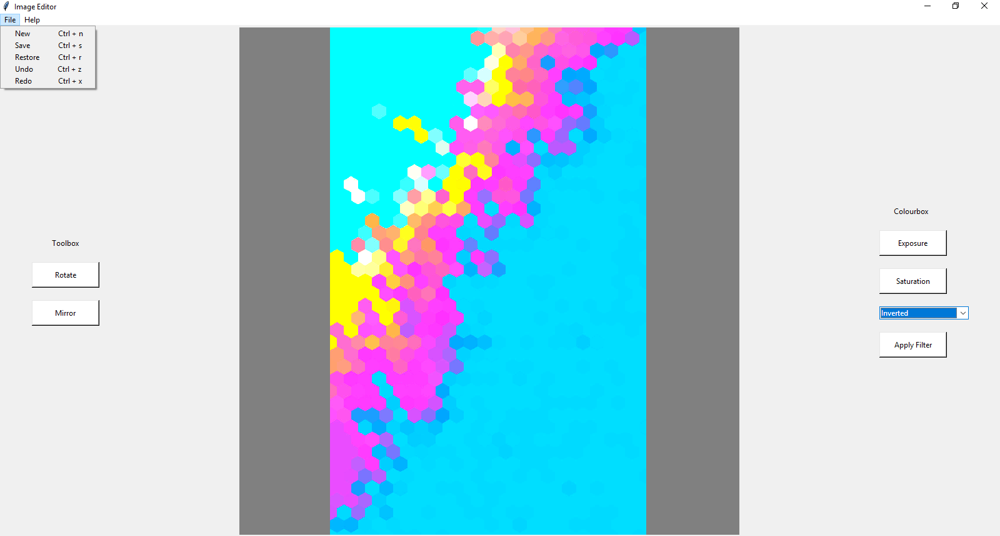
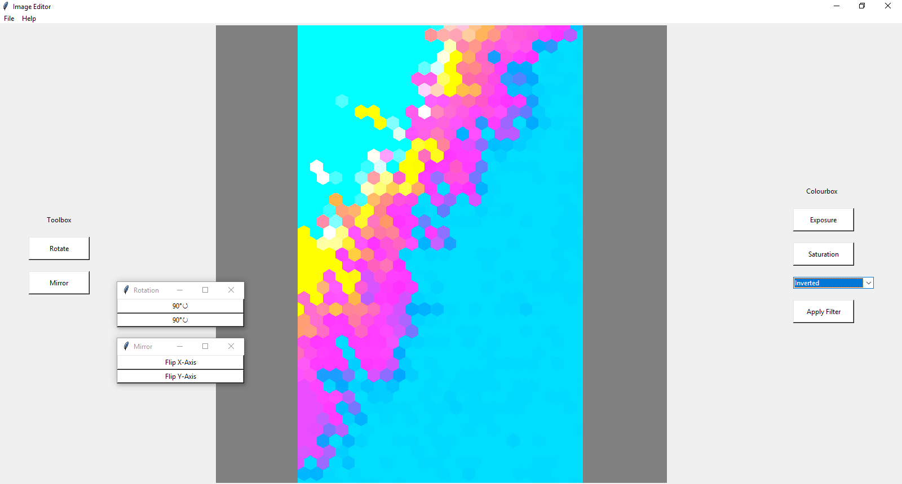
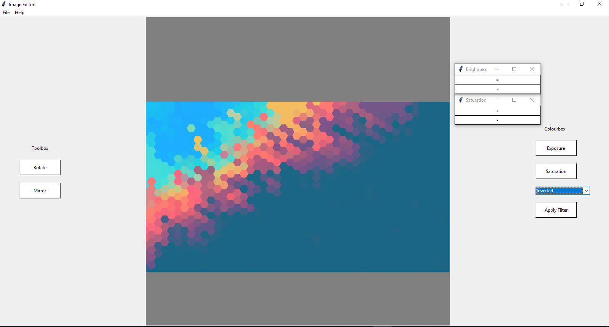
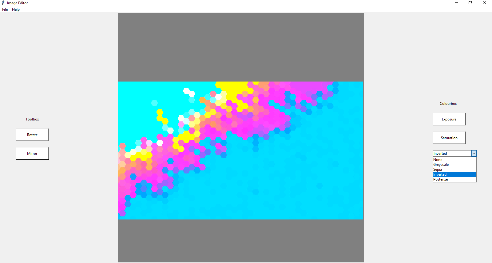

WELCOME TO MY PHOTO EDITOR
----------------------------
[FOR BEST RESULTS, USE MAC/OS OR WINDOWS/OS]

-The top left bar has help and file buttons

    -"Help" gives a brief explanation to all program features

    -"File" performs all basic file operations (New, Save, Restore, Undo/Redo)

----------------------------

-The left side has Toolbox options for altering physical aspects to the photo

    -"Rotate" rotates an image 90 degrees counter/clockwise

    -"Mirror" flips an image along the x/y axes

----------------------------
-The right side has Colourbox options for altering digital aspects to photos

    -"Exposure" changes the brightness (Beware that the image is altered every press, so upping the exposure and downing it will distort the image)

    -"Saturation" changes the warmth/coldness of colours of photo

    -"Filters" applys premade filters to the photo

Before

After

----------------------------
